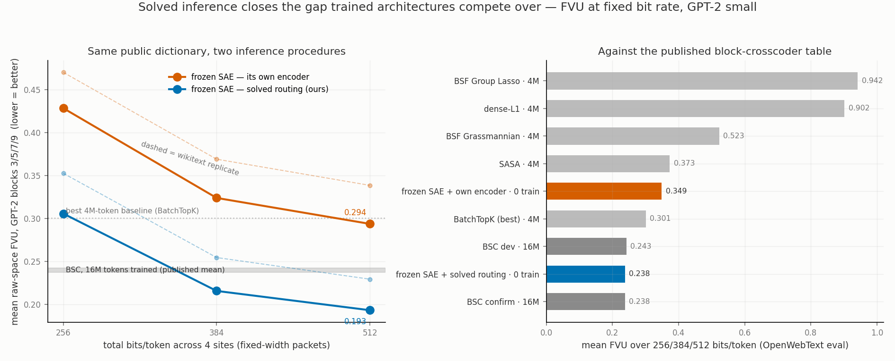

# Solved inference vs. trained architecture: FVU at fixed bit rate on GPT-2 small

**One-line result.** On the [block-crosscoder-experiment](https://github.com/a9lim/block-crosscoder-experiment) benchmark's own currency — mean raw-space FVU over GPT-2-small residual sites at fixed total bit rates — a **frozen, publicly downloaded SAE with solved inference (zero training) scores 0.238, statistically tying the benchmark's best method, a block-sparse crosscoder trained on 16M tokens (0.238–0.243), and beating every 4M-token-trained baseline** (best: 0.301). The identical dictionary decoded through its own learned encoder scores 0.349. The gap between those two numbers — the *amortization gap* — is larger than the gap between any two trained architectures in the table.

## Methods

**Protocol shape (from the reference benchmark).** Reconstruct residual-stream activations of GPT-2 small at four sites (`blocks.{3,5,7,9}.hook_resid_pre`) under a total code budget of 256, 384, or 512 bits per token, and report the raw-space fraction of variance unexplained (FVU = ‖x−x̂‖²/‖x−x̄‖²), averaged over sites and budgets; lower is better. Evaluation corpus OpenWebText (a wikitext-103 replicate is included as a robustness check — same ordering, slightly higher absolute FVU).

**Dictionary.** No dictionary was trained for this experiment. Both arms use jbloom's public per-site GPT-2 SAEs (`jbloom/GPT2-Small-SAEs-Reformatted`, K = 24,576 atoms per site, trained without any bit constraint), loaded raw from safetensors. Activations captured via transformer_lens (whose weight-processing convention these SAEs were trained on; unconstrained reconstruction EV 0.81–0.90 per site confirms the hookup).

**Bit accounting.** Fixed-width packets, identical for both arms: each active slot pays ⌈log₂K⌉ = 15 selection bits + 7 amplitude bits (uniform quantizer on the observed amplitude range). The per-token budget is split evenly across the four sites; the slot count per site is k = ⌊(budget/4)/22⌋, i.e. k = 2/4/5 at the three budgets. This mirrors the reference's fixed-width packet form but does **not** include its serialized-codec byte overhead (a small constant affecting cross-table comparability, not the arm-vs-arm delta, since both arms pay identical bits).

**The two arms differ only in inference.**

- *Encoder arm* — the SAE's own amortized encoder (`ReLU((x−b_dec)W_enc+b_enc)`), truncated to its top-k features per token, amplitudes quantized.
- *Solved arm* — the encoder is discarded. Support is chosen by batched greedy orthogonal matching pursuit against the decoder, amplitudes re-solved by joint least squares on the selected support at every step, then quantized identically. ~40 lines of torch; no learned parameters.

**Sample.** 122k real tokens (position 0 and padding excluded), single deterministic pass. The reference numbers are two-seed means; treat the final digit of all comparisons accordingly.

## Results

| bits/token | encoder arm | solved arm | Δ (amortization gap) |
|---|---|---|---|
| 256 | 0.429 | **0.306** | −0.123 |
| 384 | 0.324 | **0.216** | −0.108 |
| 512 | 0.294 | **0.193** | −0.100 |
| **mean** | 0.349 | **0.238** | −0.110 |

Published table (same three-budget mean, GPT-2 phase): BSC confirm **0.2378** / dev 0.2426 (16M tokens); decoder-weighted BatchTopK 0.3024, scalar BatchTopK 0.3009, SASA 0.3732, BSF Grassmannian 0.5235, Anthropic dense-L1 0.9020, BSF Group Lasso 0.9422 (all 4M tokens).

Per-site FVUs, the unconstrained-dictionary floor (0.100/0.135/0.160/0.184 at layers 3/5/7/9), and both corpora's raw numbers are in `issue_2502_fvu_at_bits_gpt2_owt.json` and `issue_2502_fvu_at_bits_gpt2.json`.

## Interpretation

1. **What TopK-style SAEs lose to amortized inference is a full method-generation at deployment bit rates.** A −0.11 FVU improvement from swapping the encoder for a solver — on a dictionary the solver never saw during training — exceeds the spread between the trained baselines and the benchmark's winning architecture. This replicates, on an external benchmark's metric, the +0.047 held-out-EV amortization gap measured earlier in this campaign (gam#2502).
2. **This does not show our architecture beats BSC.** It shows *inference quality dominates architecture* in this regime: the solved arm ties a 16M-token cross-layer method while coding each site independently (no cross-site support sharing — the BSC's structural advantage), with zero training. A fair architecture comparison requires all entrants to be evaluated under solved inference; otherwise the benchmark measures encoders, not representations.
3. **The universal-improver consequence.** Solved routing is a drop-in improvement to any existing SAE-family dictionary — no retraining, deployable wherever a ~k-iteration pursuit per token is affordable, and where it is not, the solver defines the target an encoder should be distilled toward, making the residual amortization gap a *reported number* per model rather than an invisible bias.
4. **Relation to the wider program.** This is the inference half of the code-space program in gam#2502 (the geometry half — the error-controlled curvature census over code amplitudes — is the companion result: 55/37,472 co-firing pairs of this same dictionary carry certified non-Gaussian joint structure). Both halves share one thesis: *the dictionary is fine; the code is where the wins are.*

## Caveats, complete list

- Reference codec overhead bytes not replicated (small constant, cross-table only).
- One deterministic pass vs their two seeds; 122k eval tokens vs their (larger) eval set.
- Our per-site coding disadvantages our arms relative to BSC's shared cross-site support — the tie is therefore conservative — but the reference's 4M-vs-16M training-budget caveat between their own baselines and BSC carries over to any reading of the full table.
- OMP here is greedy with per-step joint LS, ridge 1e-6, non-negativity clamp at the end; no gap-safe screening or optimality certificates yet (that is the planned certified-pursuit upgrade).
- Quantizer is uniform on [0, max]; an entropy-coded amplitude law (the description-length machinery in gam-sae) would improve both arms further.

## Provenance

Benchmark script: `scratchpad/bench_fvu.py` (this session), `EVAL_CORPUS=owt`. Data artifacts `issue_2502_fvu_at_bits_gpt2_owt.{png,json}` @ `612531d21`, `issue_2502_fvu_at_bits_gpt2.{png,json}` @ `263c27a29`. Census companion results and code: gam#2502 comments of 2026-07-31; code at `b7bf04aa5` and `6541fe528`. Hardware: 1× A10 (Lambda), ~25 min total GPU; analysis on MSI acn112.
