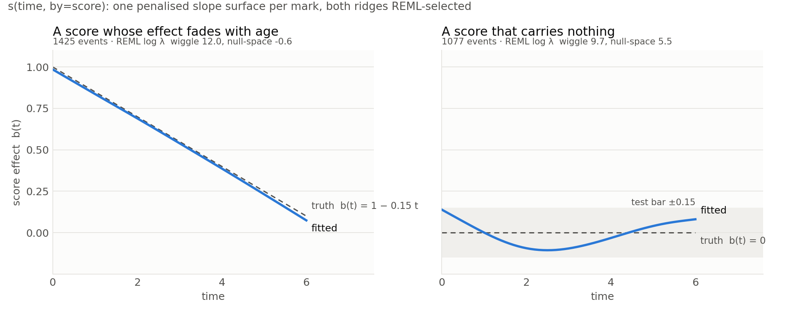

# Event histories

`gam_models::event_history` fits marked counting processes: each subject is
observed over a follow-up window, events of several marks happen, some marks
happen at most once (a first diagnosis), some end follow-up (death), and
covariates may change over time. First diagnoses of many diseases, recurrent
events, competing risks, dynamic frailty and history-conditioned prediction
are one family: they differ only in the rows and the kind of each mark.

## The model

For subject `i` and mark `d` the intensity is

```text
log λ_{i,d}(t) = η⁰_{i,d}(t) − ½ Σ_k a_{d,k}² + Σ_k a_{d,k} z_{i,k}(t)
```

`η⁰` is an ordinary gam linear predictor built from the covariate table plus
the node time, so every term type in the formula language applies: smooths of
age or calendar time, smooths of covariates, tensor terms, random effects.
`z_{i,k}` are independent unit-variance Ornstein–Uhlenbeck atoms with rates
`r_k`, shared by all marks through the loadings `a_{d,k}`.

The latent term is the individual's deviation from a population rate, not an
addition to it. The atoms are stationary and standard at every time, so
`E_z exp(Σ_k a_{d,k} z_{i,k}) = exp(½ Σ_k a_{d,k}²)`, and the shift cancels
it exactly:

```text
E_z λ_{i,d}(t) = exp(η⁰_{i,d}(t))
```

whatever the loadings. `η⁰` is therefore the population-average
log-intensity surface — the coefficients, `mark_eta`, and the CLI's
`coefficients` all describe population rates — and raising the latent
heterogeneity does not raise the population rate behind the baseline's back.

The likelihood is that of a marked counting process with per-mark risk
sets:

```text
ℓ_i = Σ_d [ ∫ log λ_{i,d}(t) dN_{i,d}(t) − ∫ R_{i,d}(t) λ_{i,d}(t) dt ]
```

`R_{i,d}` is one while the subject is at risk for `d`: always for a
recurrent mark, until the first occurrence for a mark that happens once (a
subject who already had it before entry is never at risk), and a terminal
mark ends every risk set. Risk-set membership is data, not a mode of the
model.

### The latent covariance is the object

With unit-variance atoms the latent part of the log-intensities has the
covariance

```text
C(Δ) = A diag(e^{−r_k |Δ|}) Aᵀ,        C(0) = A Aᵀ,
```

a learned multi-output covariance operator over marks and time. `C` is what
the fit reports (`disease_covariance`, `temporal_covariance(lag)`,
`eigenmodes`); the loadings `A` are its factor coordinates, which two atoms
of equal rate could rotate without changing anything. There is no chosen
number of signatures, no simplex, no healthy state: the marks' shared
structure is a covariance whose rank the evidence decides.

### Rank is grown by the evidence

The fit starts at rank zero, the Poisson-process GAM. At rank `K` it
computes the covariance score

```text
M(r) = Σ_i [ Σ_{n,m} e^{−r |t_n − t_m|} s̄_{in} s̄_{im}ᵀ − Σ_n diag(c̄_{in}) ]
```

from the residual scores `s̄ = y − w μ̄` at the posterior-mean intensities.
Adding an atom with loading `v` and rate `r` changes the evidence by
`½ vᵀ M(r) v` to second order (the first order vanishes by the `v → −v`
symmetry). The rate is chosen by the *standardised* gain `U²/(2 Var U)`,
the matched filter, not by the raw score: a slower kernel dominates every
faster one entrywise, so the raw score alone always names a static frailty.
The information carries the process's own diagonal,

```text
Var U = ½ Σ_{n,m} e^{−2r|Δ|} κ_n κ_m + ¼ Σ_n Σ_d v_d⁴ c̄_{nd},
```

the second term being the variance a count carries at one instant
(`Var s² = c + 2c²` for a Poisson increment). Without it the filter runs to
white noise on any point process, whose residuals are event spikes. The top
eigenpair of `M` at the maximising rate is then the most evidence-improving
covariance direction the current rank omits. The
new atom starts there, scaled by the one-step estimate of its variance
component, with every previous block warm-started, and the whole model is
refit under LAML. The atom is kept only if the outer criterion decreased by
more than the solver's own resolution; otherwise the fit stops at rank `K`.
There is no `atoms=` parameter and no symmetric initialisation to break:
each direction is proposed by the data and accepted by the evidence. The
fit records every step in `rank_path` and each accepted atom's evidence gain
in `atom_evidence`.

Each atom still carries one REML ridge over its loadings and its log-rate,
so an atom that stopped being needed once later ones arrived is pinned, not
left unidentified; rates are parameterised as `ln(r_k · T̄)` with `T̄` the
mean follow-up, so their prior centre is the cohort's own time scale.

### The engine: Laplace on the Markov structure

The latent path of a subject is integrated out by a Laplace approximation
on its node expansion. The complete-data log-density is strictly concave in
the path (a Poisson log-link is concave in its linear predictor; the
Ornstein–Uhlenbeck prior is Gaussian with block-tridiagonal precision), so
its mode is unique and Newton's method reaches it. The negative Hessian at
the mode is block tridiagonal with `K × K` blocks, so the evidence, its
determinant, the smoother marginals and every derivative cost `O(N K³)` per
subject: polynomial in the number of atoms, never exponential. The Laplace
error is `O(1 / expected count)` per node and vanishes as information
accumulates; it is the one approximation the family makes, and it is what
lets the rank be decided by the evidence rather than by a quadrature
ceiling.

The compensator is integrated by a *closed* rule (Gauss-Lobatto) on every
segment between breakpoints, so an event time — always a breakpoint — is a
node of the compensator as well as the instant whose intensity the
likelihood reads. With an open rule it would not be: the event node would
carry a count and no exposure, its latent coordinate would be held only by
the prior once the process decorrelates across a mesh cell, and the
evidence would gain `a²/2` per event without bound. The continuous-time
model has no such corner, and the closed rule keeps the discretisation from
inventing one.

The gradient the inner Newton uses is the exact derivative of the Laplace
objective through the implicit dependence of the mode on the parameters
(the implicit-function correction needs only the block-tridiagonal part of
the posterior covariance and one extra solve). The Hessian and its
directional derivatives are the tangent channels of that gradient computed
on a forward-mode dual scalar, contracted with the design rows node by node:
nothing of size `(nodes × marks)²` is ever formed.

Survival with a static frailty is one atom with rate zero; competing risks
is terminal marks; first diagnoses are once-only marks.

## Fitting

```rust
use gam_models::event_history::*;

let mut cohort = EventHistoryCohort { mark_names, mark_kinds, covariate_names, covariates, subjects };
let spec = EventHistorySpec::new(vec![term_collection_spec]);
let fit = fit_event_history(&mut cohort, &spec)?;
fit.rank();                 // atoms the evidence supports
fit.disease_covariance();   // marks × marks
fit.temporal_covariance(2.0);
fit.eigenmodes()?;
fit.loadings;               // factor coordinates, marks × rank
fit.rates;                  // per atom, in the data's time unit
fit.atom_evidence;          // evidence gain of each accepted atom
fit.rank_path;              // every step tried
```

`covariates` holds one term collection shared by every mark, or one per mark.
Feature columns index the covariate table's columns followed by the node time,
so a smooth of column `n_cov` is a smooth of time. Events at or before a
subject's entry are prior history: not modelled, but they remove the subject
from the risk set of a once-only mark.

## Observed risk scores

An observed subject-level score `g` — a polygenic score, a calibrated
biomarker — enters as a penalised slope surface, the varying-coefficient
smooth of the formula language:

```text
s(time, by=prs)
```

This is `b_d(t) · g_i` added to mark `d`'s log-intensity. A continuous
by-smooth keeps its constant (its constant direction is `g` itself, not the
intercept, so there is nothing to centre away), which makes `b_d` one
surface with two REML-selected ridges: the wiggliness ridge decides how much
the score's effect bends with time, and the null-space ridge (on the constant
and linear parts of `b_d`, the double penalty every smooth carries by default)
decides whether the effect exists at all. A score that carries nothing
collapses to `b_d ≡ 0`; a useful, age-invariant score becomes a constant; an
effect that genuinely fades with age becomes a smooth decline — the
smoothing parameters decide, not a hand-chosen interaction or age band. With
several marks every mark gets its own `b_d(t)` under the same rule.

The score sits *beside* the latent state, not inside it: `g` is observed, so
the intensity is conditional on it, while the latent state carries what the
event history reveals. Feeding a state inferred from the outcomes back in as
an observed score would use the outcomes twice.



*The fixture behind the figure: 300 subjects, six time units, a
standard-normal score. Left, the truth `b(t) = 1 − 0.15 t` is recovered
within 0.02 everywhere and the wiggliness ridge goes to its limit (the truth
is a line). Right, a score that carries nothing collapses under both ridges.*

### Calibrated scores

A polygenic score is confounded by ancestry, so the same raw value means
different things in different parts of the cohort. The conditional
transformation-normal Stage 1 of the marginal-slope chain calibrates it once,
in front of the fit:

```python
calib = gamfit.fit(scores, "prs ~ s(pc1) + s(pc2)", transformation_normal=True)
covariates["prs_z"] = calib.transformation_score(scores)
model = gamfit.fit_event_history(subjects, events, covariates, "s(time, by=prs_z)", once=[...], terminal=["death"])
```

`prs_z = Φ⁻¹(F̂(prs | pc))` is standard normal given ancestry, so `b_d(t)` is
the effect of one conditional standard deviation of the score everywhere in
the cohort, and a population forecast at `prs_z = 0` is the population rate
at every ancestry. Nothing else changes: the slope surface, its two ridges
and the latent state are as above.

## The information hierarchy

Three conditionings of one model, none weighted by hand:

```rust
// population: the stationary prior, population covariate values
let population = population_forecast(&fit, &cohort, &[0.0], 60.0, &[65.0, 70.0])?;
// score only: the same filter at the subject's own covariates, no history
let alone = population_forecast(&fit, &cohort, &[1.8], 60.0, &[65.0, 70.0])?;
// score and history: the filter continues from the subject's smoothed state
let updated = forecast(&fit, &cohort, &subject, &[65.0, 70.0], future_row)?;
```

With no information the forecast is the population risk; a score moves it by
what the fitted slope surface says the score is worth at that age; the
history moves it again by what the events reveal about the latent state. A
weak score leaves the history to do the work; a strong score moves the risk
before any history exists.

## Python

```python
import gamfit
model = gamfit.fit_event_history(
    subjects, events, covariates, "x + s(time)",
    once=["diabetes", "asthma"], terminal=["death"],
)
model.rank, model.disease_covariance(), model.temporal_covariance(5.0), model.eigenmodes()
model.loadings, model.rates, model.atom_evidence, model.rank_path
p = model.forecast("subject-17", horizons=[60.0, 65.0, 70.0])
p["risk"]        # horizons × marks: P(first occurrence by horizon, alive | history); NaN if already present
p["survival"]    # P(no terminal event by horizon | history)
q = model.population_forecast({"x": 0.0, "prs": 0.0}, start=60.0, horizons=[65.0, 70.0])
s = model.latent_state("subject-17")      # times, means (nodes × rank), covariances (nodes × rank × rank)
e = model.latent_exposure("subject-17")   # mean (rank), covariance (rank × rank)
model.pit("subject-17"); model.pit_ks()
```

`subjects` has columns `id, entry, exit`; `events` has `id, time, mark`;
`covariates` has `id, start` and the covariate columns, one row per segment
during which a subject's covariates are constant. Frames may be pandas,
polars, or dicts of columns. `once` and `terminal` name the marks that happen
at most once and the marks that end follow-up; every other mark may recur.
`population_forecast` takes the covariate values of a subject with no
observed history: population values give the population tier, a subject's
own score gives what the model says before its history is seen.

## CLI

```bash
gam fit-events --subjects s.csv --events e.csv --covariates c.csv \
    --formula "x + s(time)" --once diabetes,asthma --terminal death \
    --horizons 1,2,5 --out summary.json
```

The summary carries the rank, loadings, rates, per-atom ridges and evidence
gains, the rank path, the disease covariance with its eigenmodes, the
coefficients, the predictive-PIT Kolmogorov–Smirnov distance over every
event, and per-subject risk forecasts at the given offsets after exit, each
with its `without_history` counterpart: the same window run from the
stationary prior at the subject's covariates, so the summary shows what the
history added.

## Forecasting, calibration and the latent phenotype

```rust
let f = forecast(&fit, &cohort, &subject, &[60.0, 65.0], future_row)?;
let p = population_forecast(&fit, &cohort, &covariate_values, 60.0, &[65.0, 70.0])?;
f.risk;             // horizons × marks
f.survival;         // P(no terminal event by horizon | history)
f.expected_counts;  // horizons × marks
let path = latent_state(&fit, &cohort, &subject)?;      // smoothed state with posterior covariance
let (mean, cov) = latent_exposure(&fit, &cohort, &subject)?;   // follow-up average, with covariance
```

A forecast takes the smoothed latent state at the subject's exit and runs a
sequential Gaussian filter over the future with zero counts. Per mark, the
compensator is restricted to that mark and the terminal marks, so the
accumulated `w · S(t⁻) · E[λ_d(t)]` is the probability of a first occurrence
of `d` by the horizon while the subject is still alive; a terminal mark's
risk is its cumulative incidence among the terminal marks. Nothing has to be
declared absorbing at forecast time. The predictive PIT of every event,
`predictive_pit`, is uniform when the model is right;
`kolmogorov_smirnov_uniform` summarises it.

The latent phenotype for discovery is the subject's smoothed state: the
Laplace posterior mean and covariance at every node (`latent_state`), and
its follow-up average with the exact posterior covariance of that average
under the Laplace posterior (`latent_exposure`). Downstream analyses get the
uncertainty, not a fitted trajectory pretending to be observed.

## What remains approximate, and what remains to scale

- The Laplace approximation over the latent path is the one approximation;
  its error is second order in the posterior's non-Gaussianity and shrinks
  with the information per node.
- The latent path is represented at the quadrature and event nodes; the
  covariance of an Ornstein–Uhlenbeck path has a kink on the diagonal, so
  the temporal discretisation error is set by the node spacing, not the
  quadrature order, and it is `O(rate · gap)` in every term. A rate the
  mesh cannot resolve is refused at the proposal (`at_resolution_limit` on
  the rank step says so), because past that point the fit would be
  measuring its own mesh. A mesh-refinement certificate — refine until the
  criterion is stable — is the natural control and is not yet part of the
  fit: on a cohort without a latent state the outer criterion drifted with
  the node count, which has to be understood before a refinement loop can
  be trusted.
- The coefficient-space Hessian is still dense over all marks' coefficients.
  Its assembly never forms a node-level matrix, but a cohort with hundreds
  of marks and hundreds of thousands of subjects needs the operator-form
  outer solve (Hessian-vector products and a stochastic log-determinant),
  which the per-node contraction is built to feed.
